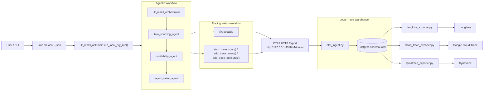
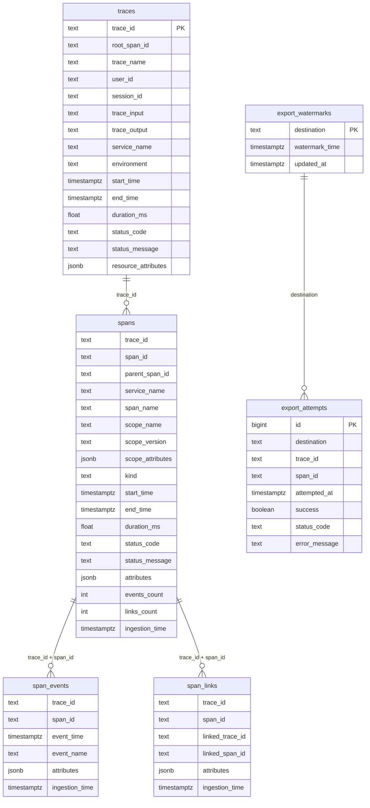

# Agentic OTEL Tracing

This project runs a multi-agent resale workflow and captures OpenTelemetry traces into a local Postgres warehouse, then exports those traces to external observability tools (Langfuse, Google Cloud Trace, Dynatrace).

Architecture diagram: `docs/architecture_diagram.md`
Postgres schema diagram: `docs/otel_schema_visualization.md`



## Quickstart

### Prerequisites

- Python 3.11+
- Docker
- Optional: `gcloud` CLI for Cloud Trace

### 1) Setup

```bash
python -m venv .venv
source .venv/bin/activate
pip install -e .
cp .env.example .env
```

Update `.env` with your provider credentials.

### 2) Start local tracing infrastructure

```bash
./scripts/postgres/start_postgres.sh
./scripts/postgres/start_otel_ingest.sh
```

Keep `start_otel_ingest.sh` running in its own terminal.

### 3) Run the agent workflow

In a second terminal:

```bash
source .venv/bin/activate
./run.sh local --json
```

### 4) Export traces

```bash
./scripts/postgres/export_to_langfuse.sh
./scripts/postgres/export_to_cloud_trace.sh
./scripts/postgres/export_to_dynatrace.sh
```

Each exporter drains all pending spans by default.

---

## Postgres + OTEL Deep Dive

## Architecture

1. `./run.sh` executes the workflow (`uk_resell_adk.main`).
2. `src/uk_resell_adk/tracing.py` creates spans/events/attributes and exports OTLP to local ingest.
3. `src/uk_resell_adk/otel_ingest.py` accepts OTLP (`/v1/traces`) in JSON or protobuf.
4. Ingest normalizes IDs, parses attributes/events/links, and writes to schema `otel` in Postgres.
5. Exporters read incremental batches using watermark checkpoints and push to each destination.

## Storage Model

Schema file: `infra/postgres/init/001_otel_schema.sql`
Full schema visualization: `docs/otel_schema_visualization.md`

### ER Diagram



Key tables:

- `otel.traces`
  - Trace envelope and identity fields:
    - `trace_id`, `root_span_id`, `trace_name`
    - `user_id`, `session_id`
    - `trace_input`, `trace_output`
    - service/environment and resource attributes
- `otel.spans` (monthly partitioned)
  - Span DAG fields: `trace_id`, `span_id`, `parent_span_id`
  - Span metadata: name, kind, status, attributes
  - Instrumentation scope preservation:
    - `scope_name`, `scope_version`, `scope_attributes`
- `otel.span_events` (monthly partitioned)
- `otel.span_links`
- `otel.export_watermarks`
  - Per-destination cursor (`langfuse`, `cloud_trace`, `dynatrace`)
- `otel.export_attempts`
  - Per-span export audit/error log

## Incremental Export Semantics

- Exporters query spans newer than destination watermark.
- Successful batches record attempts and advance watermark.
- Failed batches record errors in `otel.export_attempts`.
- `--continuous` keeps polling after backlog is drained.

## Why this design helps

- Destination-agnostic trace replay from one source of truth.
- Side-by-side tool comparison with identical source traces.
- SQL-level debugging for trace quality and exporter failures.
- Isolation from transient outages/rate limits of external tools.

## Operational Commands

### Inspect ingestion progress

```bash
./scripts/postgres/psql_postgres.sh -Atc "SELECT max(start_time), count(*), count(DISTINCT trace_id) FROM otel.spans;"
```

### Inspect watermarks

```bash
./scripts/postgres/psql_postgres.sh -P pager=off -c "SELECT destination, watermark_time, updated_at FROM otel.export_watermarks ORDER BY destination;"
```

### Inspect recent export errors

```bash
./scripts/postgres/psql_postgres.sh -P pager=off -c "SELECT attempted_at, destination, success, status_code, left(coalesce(error_message,''), 400) FROM otel.export_attempts ORDER BY attempted_at DESC LIMIT 20;"
```

### Clear trace data and reset watermarks

```bash
./scripts/postgres/clear_postgres.sh --yes
```

---

## Export Destinations

## Langfuse

```bash
export LANGFUSE_PUBLIC_KEY="pk-lf-..."
export LANGFUSE_SECRET_KEY="sk-lf-..."
export LANGFUSE_BASE_URL="https://cloud.langfuse.com" # or self-hosted
./scripts/postgres/export_to_langfuse.sh
```

## Google Cloud Trace

```bash
gcloud auth application-default login
gcloud auth application-default set-quota-project <gcp-project-id>
export CLOUD_TRACE_QUOTA_PROJECT="<gcp-project-id>"
export CLOUD_TRACE_PROJECT_ID="<gcp-project-id>"
export CLOUD_TRACE_OTLP_ENDPOINT="https://telemetry.googleapis.com/v1/traces"
./scripts/postgres/export_to_cloud_trace.sh
```

## Dynatrace

```bash
export DYNATRACE_OTLP_ENDPOINT="https://<environment-id>.live.dynatrace.com/api/v2/otlp/v1/traces"
export DYNATRACE_API_TOKEN="dt0c01...."
./scripts/postgres/export_to_dynatrace.sh
```

---

