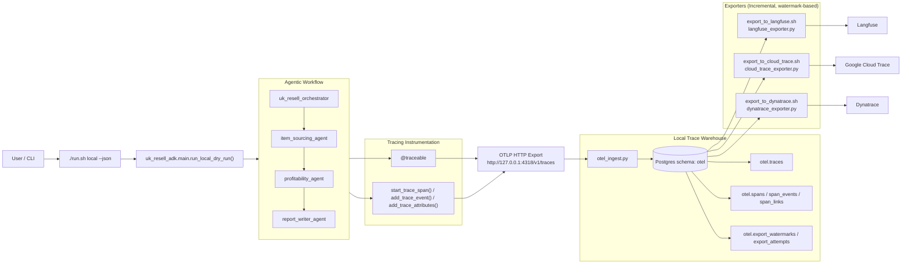

# Architecture Diagram

## Notes

- Exporters read new rows since each destination watermark and advance on success.
- One workflow run can be exported to multiple destinations from the same Postgres source data.
- `otel.export_attempts` provides per-span delivery audit/error logs.
