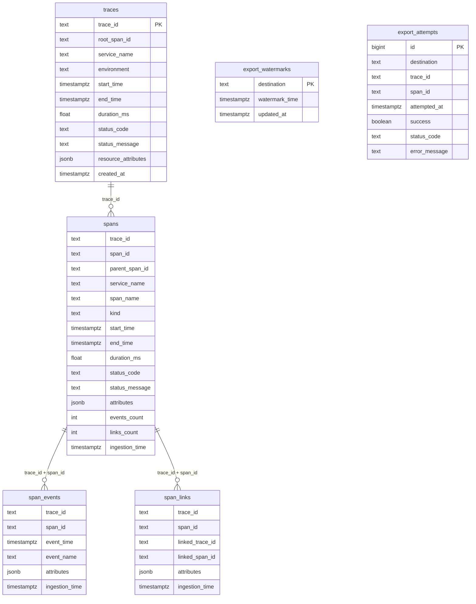

# OTel Postgres Schema Visualization

Open this file in VS Code and use **Markdown: Open Preview** to view the ER diagram.

## Partitioning

- `otel.spans` is range-partitioned by `start_time` (monthly partitions).
- `otel.span_events` is range-partitioned by `event_time` (monthly partitions).

Current partitions in your DB:

- `otel.spans_202503`, `otel.spans_202603`, `otel.spans_202604`
- `otel.span_events_202503`, `otel.span_events_202603`, `otel.span_events_202604`

## Key Indexes

- `traces`: PK on `trace_id`, plus service/status/time and JSONB GIN index.
- `spans`: indexes on `trace_id`, `span_id`, `parent_span_id`, `span_name`, service/status/time, JSONB GIN.
- `span_events`: `(trace_id, span_id, event_time)` and `(event_name, event_time)` plus JSONB GIN.
- `span_links`: `(trace_id, span_id)` and `(linked_trace_id, linked_span_id)`.

## Dedupe Constraints

- `spans`: unique `(trace_id, span_id, start_time)`
- `span_events`: unique `(trace_id, span_id, event_time, event_name)`
- `span_links`: unique `(trace_id, span_id, linked_trace_id, linked_span_id)`
